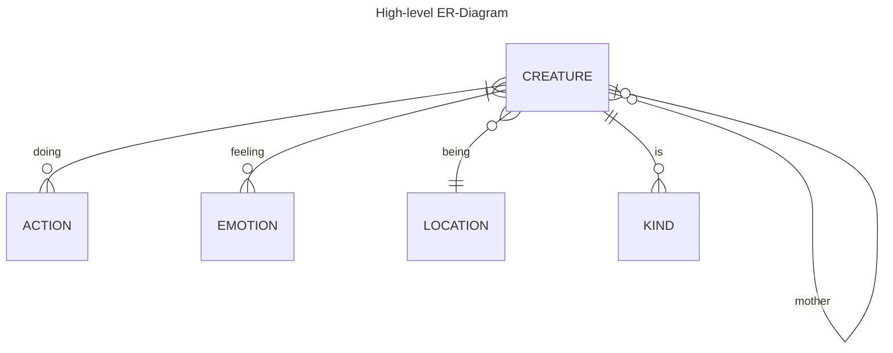

# Первый взгляд

Все действующие лица -- Динозавриха, малыш и 
существо -- идут в одну таблицу с живыми
существами. Живым существам логично иметь
эмоции и что-то делать. Поэтому я 
создал по табличке. Также можно уточнить их
местоположение в пространстве, для этого
сделана таблица с локациями. Ну и существа
бывают разных видов, для которых тоже хорошо 
бы выделить отдельную таблицу.

